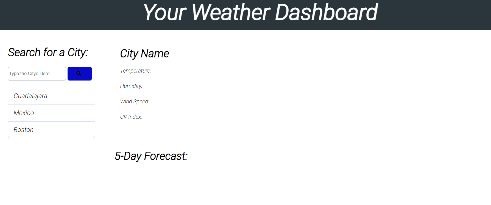
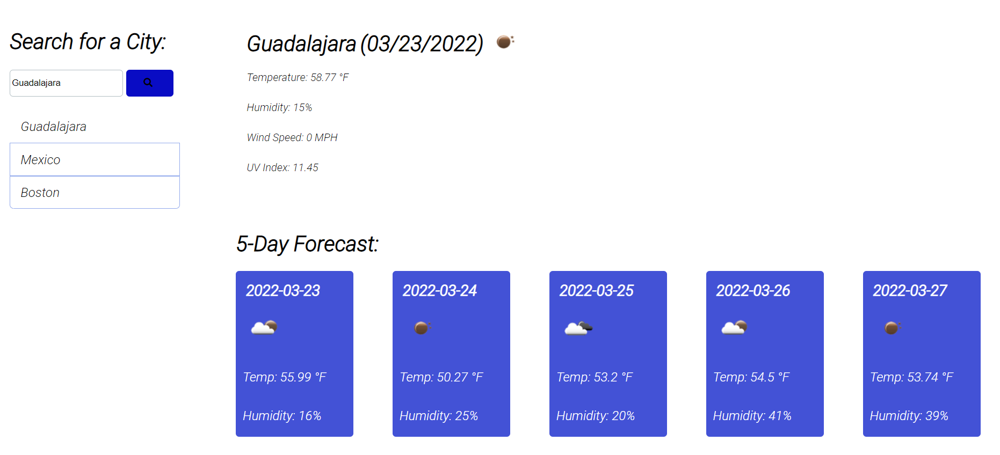

# Weather Dashboard

## Description

This is a basic weather dashoboard where you can get the information of different cities.

## Usage

The way for you to use this dashboard is simple just click the city you want to know about and then wait for the result to come up

    
    
    

## Credits

I found the base of my code under this gitHub (https://github.com/dhens/Weather-Dashboard). I used this code to coomplete the homework.

## Links
